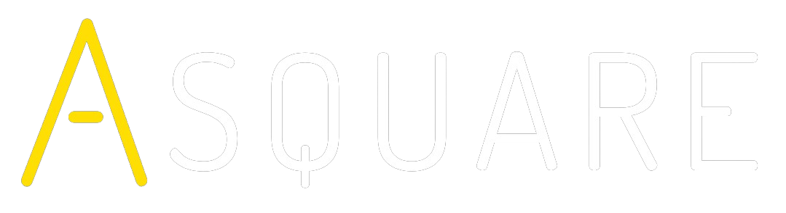

<!-- Title -->

    
    <h1 align="center">ASQUARE</h1>

<!-- Header -->

  <b>Asquare is a Password Manager Application build in react native with Realm as local database</b>
   
<!-- 
  

    
     
  
 -->
  

 
## Look and feel

Once you're up and running with asquare

## SETUP & USAGE

- To start, Download or clone the repository by using `git clone https://github.com/arunahuja94/asquare.git`
- npm install

## TO-Do List

- More to be added Soon .... 

## Contributing

1. Fork it
2. Create your feature branch (`git checkout -b feature/fooBar`)
3. Commit your changes (`git commit -m 'Add some fooBar'`)
4. Push to the branch (`git push origin feature/fooBar`)
5. Create a new Pull Request

## Support Us

If you like this project please give a star

