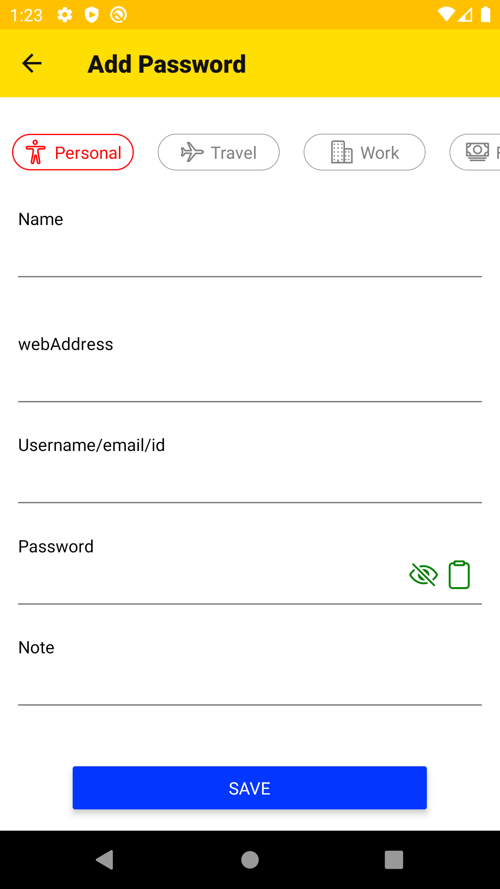

<!-- Title -->

    
    <h1 align="center">ASQUARE</h1>

<!-- Header -->

  <b>Asquare is a Password Manager Application build in react native with Realm as local database</b>
   

  

    
     
  

  

## Look and feel

Once you're up and running with asquare

  
  
  
  
  
  
  
  
  

## SETUP & USAGE

- To start, Download or clone the repository by using `git clone https://github.com/arunahuja94/asquare.git`
- npm install
- npx react-native run-android

## FEATURES LIST

- NO App Permission required
- No Network/internet required
- Jail Break Detection
- App Lock with Master Password and Fingerprint Scanner
- REALM for local databse for storing data with AES256 Encryption (encryption key on the basis of user's Master Password)
- Add, edit, View Password with different categories
- Add, edit, View Cards (debit/credit)
- Download data in csv file
- Download backup file (encrypted with users master key)
- Restore data with backup file
- much more ...

## TO-Do List

- Jest with github action for npm test
- Multi Language -- logic implementation done ( text updation in app pending )
- Theme Support
- Add password category dynamically
- Code refactoring (Progressive..)
- More to be added Soon ....

## Contributing

1. Fork it
2. Create your feature branch (`git checkout -b feature/fooBar`)
3. Commit your changes (`git commit -m 'Add some fooBar'`)
4. Push to the branch (`git push origin feature/fooBar`)
5. Create a new Pull Request

## Support Us

If you like this project please give a star
